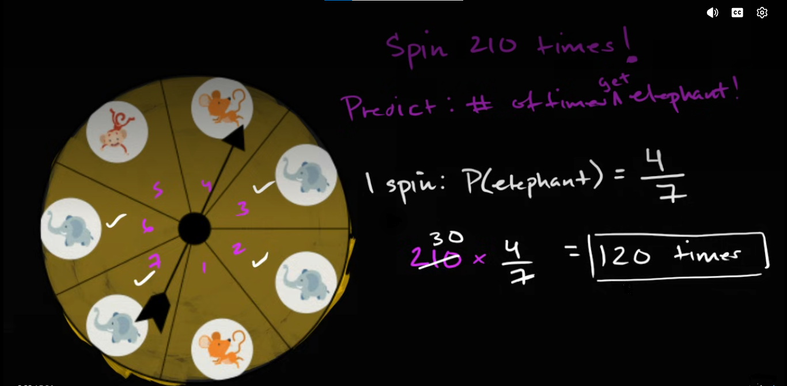

## Introduction {.unnumbered}

Consider a spinner divided into seven equally likely regions. Four regions contain an elephant, two contain a mouse, and one contains a monkey. The learner is asked to predict how many times the spinner will land on an elephant if it is spun 210 times.

{#fig-spinner-problem fig-align="center"}

A conventional solution begins by finding the probability of landing on an elephant:

$$
P(\text{elephant})=\frac{4}{7}.
$$

It then multiplies this probability by the number of spins:

$$
210\times\frac47=120.
$$

The predicted answer is therefore written as $120$ times. From the perspective of computation, the solution appears complete. The probability has been identified, the multiplication has been performed, and the correct numerical result has been obtained. Yet the shortness of the calculation conceals nearly all the interpretive and relational work that makes it meaningful. For example, why can a number that counts spins be multiplied by a fraction constructed from regions? What relationship allows the internal structure of one spinner to predict a result across 210 separate trials? Why does the denominator $7$, which initially counts regions, later appear to divide a number $210$ that counts spins? What kind of quantity is $120$ produced by the multiplication, and how should the learner determine the unit or descriptive label attached to the answer? These questions surrounding are real mathematics and they concern the mental structure that must exist before the calculation can be understood as a solution.

The initial step in solving mathematical problems is to determine the roles of symbols or quantities being presented. For example, the role of number $7$ is to initially count all equally likely regions in one spin. The number $4$ counts the regions that produce the desired result. The fraction $\frac47$ expresses the probability of an elephant result on one complete trial. The number $210$ counts how many times that trial is repeated. The final number $120$ represents the expected, rather than guaranteed, number of elephant outcomes.

| Presented information | Role in the probability model |
|---|---|
| Seven equal regions | The complete set of equally likely outcomes for one spin |
| Four elephant regions | The favorable outcomes within that set |
| $\frac47$ | The probability of an elephant result on one spin |
| One spin | One complete probability trial |
| 210 spins | The number of times the trial is repeated |
| 120 | The expected number of elephant outcomes |

After, these roles have been identified, the relationship between quantities must be determined. Role assignment tells us what each component means; relational integration tells us why the components belong together. The seven regions and the 210 spins are not instances of the same object. At the start of the problem, these two objects or quantities are unrelated since one quantity describes the internal possibility structure of a single trial, while the other describes how many times that trial is performed. The fraction $\frac47$ connects them, but this connection must be constructed rather than assumed.

```{mermaid}
flowchart LR
    A["7 equally likely regions"] --> B["4 elephant regions"]
    B --> C["One-spin probability: 4/7"]
    C --> D["210 repeated spins"]
    D --> E["Expected elephant count"]
```

The movement represented in this diagram is compressed into the expression

$$
210\times\frac47.
$$

This article reconstructs the hidden thought process through five connected realizations. It begins by examining how the phrase “210 times” must be interpreted as 210 complete probability trials. It then investigates how the learner can determine what kind of quantity the answer represents and why the result must retain a meaningful descriptive unit. The third section distinguishes the numerical commutativity of multiplication from the different conceptual roles played by the factors. The fourth examines what must be established before dividing $210$ by $7$ in order to be interpreted as forming groups of trials. The final section expands the compact multiplication into repeated expected contributions, showing how $\frac47$ can be understood as being applied across all 210 trials.

As we know that, the spinner contains seven equally likely regions, four of which contain an elephant. Therefore,

$$
P(\text{elephant on one spin})
=
\frac{\text{number of elephant regions}}
{\text{total number of equally likely regions}}
=
\frac47.
$$

Due to its distinct role, the number $7$ is part of structure of the problem that counts the equally likely regions available during one trial. The $210$ in statement “spin the spinner 210 times” in its original verbal form, however,  describes only how many times an action will be performed. Moreover, the number $210$ is not part of the structure of the problem that forms the region. Because these numbers belong to different structures therefore this makes them different objects and no direct relationship between them should yet be assumed.

$$
\text{one complete spin}
\longrightarrow
\text{one of seven equally likely regions}.
$$

$$
\text{one complete spin}
\longrightarrow
\text{repeated 210 times}.
$$


```{mermaid}
flowchart LR
    A["One complete spin"] --> B["7 possible regions"]
    A --> C["Repeated 210 times"]
    B --> D["4 elephant regions"]
    D --> E["Elephant probability"]
```

Therefore, before the learner can understand the expression. 

$$
210\times\frac47,
$$

the phrase “210 times” must be reorganized mentally as a collection of “210 complete probability trials”. 

## From “210 Times” to 210 Complete Probability Trials

In terms of probability, the meaning of one complete spin is one complete trial. Calling the spin as complete does not mean that all seven regions are visited during that spin. Instead, a single spin actually lands on only one region and each new spin begins with the complete set of seven possible regions available to it. One of those possible regions will become the observed result of the spin. For example, the first spin or trial has seven possible regions. After it has finished, the second spin once again has the same seven possible regions. The same possibility structure is recreated for the third spin and continues to be recreated throughout the experiment. The $210$ spins can therefore be represented as

$$
210\text{ spins}
=
\underbrace{
1\text{ complete trial}
+
1\text{ complete trial}
+
\cdots
+
1\text{ complete trial}
}_{210\text{ complete trials}}.
$$

If we instead talk about fractions, then each trial would then be translated to one complete whole and hence the $210$ trials are interpretated as $210$ wholes. Therefore, each spin is one complete trial in terms of probability experiment and each trial is one whole in terms of fractions.

If we now shift our focus towards the numerator $4$ and denominator $7$ we must note that they both count regions:

$$
\frac{4\text{ elephant regions}}
{7\text{ total regions}}.
$$

The fraction is therefore dimensionless in the numerical sense because it compares a count of regions with another count of regions. Semantically, however, it preserves a classification relationship: four members of the complete set of seven possible regions belong to the elephant category.

Morevoer, the fraction $210\times\frac47,$ becomes a probability because one spin selects one of those seven equally likely regions. This selection mechanism supplies the relationship between the physical spinner and the result of a trial:

$$
\begin{aligned}
&\text{one spin selects one region},\\
&\text{four of the seven possible regions contain elephants},\\
&\therefore P(\text{elephant on one spin})=\frac47.
\end{aligned}
$$

Without the relationship “one spin selects one region,” the fraction $\frac47$ would describe only the visible composition of the spinner. It becomes a statement about the possible result of a trial because the action of spinning connects the set of regions to the outcome that will be observed. The reasoning has therefore passed through several related but distinct objects:

```{mermaid}
flowchart LR
    A["Spinner"] --> B["7 equal regions"]
    B --> C["4 elephant regions"]
    C --> D["Probability 4/7"]
```

The spinner is the physical object. Its seven regions form the complete possibility structure. Four regions form the favorable part of that structure. Because a spin selects one region, the favorable-to-total relationship becomes the probability of an elephant outcome on one trial. The objects differ, but their relationships integrate them into one model.

Once $\frac47$ has been established as the probability governing one complete spin, the number $210$ can enter the same relational structure. Each of the 210 spins is a new performance of the same experiment. The same spinner is used, the same seven possible regions are available, and the same four regions produce an elephant result. Consequently, the probability $\frac47$ applies to each complete trial:

$$
\begin{aligned}
\text{spin }1 &: P(\text{elephant})=\frac47,\\
\text{spin }2 &: P(\text{elephant})=\frac47,\\
\text{spin }3 &: P(\text{elephant})=\frac47,\\
&\ \vdots\\
\text{spin }210 &: P(\text{elephant})=\frac47.
\end{aligned}
$$

The number $210$ and the probability $\frac47$ can now be combined because the relationship between them has been established. The number $210$ counts complete trials, while $\frac47$ describes the probability associated with each of those trials. The expression $210\times\frac47$ therefore does not arise merely because both numbers are present in the question. It arises because one probability model is repeatedly applied across a collection of 210 complete trials. One way to expose the structure compressed by multiplication is to expand it as repeated addition:

$$
\underbrace{
\frac47+\frac47+\cdots+\frac47
}_{210\text{ expected contributions}}.
$$

This expansion must be interpreted carefully. It does not claim that one observed spin produces $\frac47$ of an elephant outcome. A physical spin produces either an elephant result or a non-elephant result. The fraction $\frac47$ describes the expected contribution of one spin when the experiment is considered across repeated performances. Multiplication accumulates those expected contributions across the 210 trials. The complete relational path can now be represented as follows:

```{mermaid}
flowchart TD
    A["4 of 7 regions are elephants"] --> B["Probability on one spin: 4/7"]
    B --> C["Same model for every trial"]
    C --> D["210 complete trials"]
    D --> E["Accumulate expected contributions"]
```

The transformation of “210 times” into 210 complete probability trials is therefore not a cosmetic change in vocabulary. It assigns $210$ to the mathematical object upon which the probability model operates. Before this transformation, $210$ is merely a count of repeated actions. After it, $210$ represents a collection of trials, each governed by the same probability relationship. The short calculation $ 210\times\frac47$ is the final compression of this reasoning. Its conceptual foundation is the longer relational statement:

$$
\begin{aligned}
&\text{Four of seven equally likely regions contain elephants}\\
&\longrightarrow P(\text{elephant on one complete spin})=\frac47\\
&\longrightarrow \text{the same probability governs each repeated spin}\\
&\longrightarrow \text{there are 210 complete spins}\\
&\longrightarrow \text{accumulate 210 expected contributions of }\frac47.
\end{aligned}
$$

Until these relationships have been constructed, $210$ and $\frac47$ are merely two quantities appearing in the same problem. Once their roles have been assigned and relationally integrated, their multiplication expresses a coherent probability model.

## Determining the Meaning and Unit of the Answer

Once the relationship between $210$ and $\frac47$ has been constructed, the learner can understand why these quantities are multiplied. However, knowing why multiplication is required does not yet tell us what the product represents. The calculation

$$
210\times\frac47=120
$$

produces the number $120$, but a number by itself does not identify the object or quantity that has been calculated. The same number could represent $120$ spins, $120$ elephant outcomes, $120$ regions, or $120$ groups. Its meaning depends upon the roles of the quantities from which it was produced and the relationship expressed by the multiplication. The next task is therefore not merely to calculate the numerical answer, but to determine what kind of quantity the calculation is capable of producing. This question can be approached in the same way that units are considered in physics. Suppose a car travels at $60$ kilometres per hour for $2$ hours. The multiplication

$$
2\times60=120
$$

does not explain by itself what $120$ represents. The focus should be on the units that preserve the relationship between the quantities:

$$
2\text{ hours}
\times
\frac{60\text{ kilometres}}{1\text{ hour}}
=
120\text{ kilometres}.
$$

The unit “hours” cancel, leaving kilometres as the unit of the result. The cancellation is not simply a decorative addition to the arithmetic. It shows that multiplying duration by distance per unit of duration produces distance. If the resulting unit did not correspond to the quantity requested by the problem, that mismatch would reveal that the quantities had been related incorrectly.

Probability problems involve a similar need to preserve meaning, although the labels used in probability are not always physical units such as metres, seconds, or kilograms. The words *spin*, *trial*, *region*, and *elephant outcome* identify what is being counted and what role each count plays. These labels prevent the learner from treating every visible number as if it represented the same kind of object. At the beginning of the problem, the probability is formed as

$$
P(\text{elephant})
=
\frac{4\text{ elephant regions}}
{7\text{ total regions}}
=
\frac47.
$$

Because both the numerator and denominator count regions, their physical counting unit cancels. For this reason, probability is numerically dimensionless. Nevertheless, the probability is not semantically empty. The value $\frac47$ retains the relationship from which it was constructed: it represents the proportion of the spinner’s equally likely outcomes that belong to the elephant category. It therefore tells us that one complete spin has a probability of $\frac47$ of producing an elephant result. The number $210$, on the other hand, counts complete spins:

$$
210\text{ spins}.
$$

If the learner now writes

$$
210\text{ spins}\times\frac47,
$$

the expression still does not visibly show how the unit “spins” becomes the unit “elephant outcomes.” The fraction $\frac47$ is numerically dimensionless, so a purely mechanical treatment of units might appear to leave the unit unchanged:

$$
210\text{ spins}\times\frac47
=
120\text{ spins}.
$$

This result is not entirely false, but it is incomplete. The calculation does identify $120$ of the $210$ spins. However, the problem is not asking for an unspecified subset of spins. Instead, the problem asks for the spins expected to produce a particular result. The complete meaning of the answer is therefore

$$
120\text{ spins expected to land on an elephant}.
$$

This longer label reveals two connected aspects of the answer. The objects being counted are spins, while the condition used to select those spins is “lands on an elephant.” The answer can consequently be described either as “120 expected elephant outcomes” or as “120 spins expected to land on an elephant.” These descriptions refer to the same predicted events, but the second makes the connection to the original collection of 210 spins more explicit. To make this transformation visible inside the expression, the probability must be interpreted through the expected contribution of one trial or spin.

Consider one complete spin. If it lands on an elephant, it contributes one elephant outcome to the final count. If it does not land on an elephant, it contributes zero elephant outcomes. We may represent these possibilities as

$$
\begin{aligned}
\text{elephant result} &\longrightarrow 1\text{ elephant outcome},\\
\text{non-elephant result} &\longrightarrow 0\text{ elephant outcomes}.
\end{aligned}
$$

The expected contribution of one spin is then determined by combining each possible contribution with its probability:

$$
\begin{aligned}
\text{expected elephant contribution from one spin}
&=
1\left(\frac47\right)
+
0\left(\frac37\right)\\
&=
\frac47.
\end{aligned}
$$

This calculation does not claim that an individual spin physically produces $\frac47$ of an elephant outcome. A particular spin produces either one elephant outcome or zero elephant outcomes. The value $\frac47$ describes the average contribution predicted for one trial when the same experiment is considered across many repetitions. It allows the probability to be expressed as an expected counting rate:

$$
\frac47
\text{ expected elephant outcomes per spin}.
$$

This interpretation has been derived from the concept of ratio of regions; it has not been created by silently changing the meaning of $4$ and $7$. The number $4$ originally counts elephant regions and the number $7$ originally counts total regions. Because one spin selects one of those regions, their ratio determines the probability of an elephant result. Because an elephant result contributes one to the final elephant count, that probability also determines the expected elephant-count contribution of one spin. The complete relational path is therefore

$$
\frac{4\text{ elephant regions}}
{7\text{ total regions}}
\longrightarrow
P(\text{elephant on one spin})=\frac47
\longrightarrow
\frac47\text{ expected elephant outcomes per spin}.
$$

Only after this relationship has been established can the multiplication be written in a form resembling dimensional reasoning:

$$
210\text{ spins}
\times
\frac{\frac47\text{ expected elephant outcomes}}
{1\text{ spin}}
=
120\text{ expected elephant outcomes}.
$$

The unit “spin” now appears in both the total number of trials and the denominator of the expected contribution per trial. The calculation can therefore be read as

$$
\cancel{210\text{ spins}}
\times
\frac{\frac47\text{ expected elephant outcomes}}
{\cancel{1\text{ spin}}}
=
120\text{ expected elephant outcomes}.
$$

The notation above is intended to expose the semantic relationship, not to suggest that probability possesses a physical unit in precisely the same way as speed or distance. The spinner probability $\frac47$ remains a dimensionless number. The phrase “expected elephant outcomes per spin” records how that number functions when it is applied to repeated trials. It tells us what is contributed, on average, by each trial and therefore explains why multiplying by the number of trials produces an expected count of elephant outcomes. The relationship between the quantities can be summarized as follows:

| Quantity | What it counts or describes | Role in the multiplication |
|---|---|---|
| $210$ spins | The complete collection of trials | The quantity across which the probability model is applied |
| $\frac47$ | The probability of an elephant on one spin | The expected elephant-count contribution of each trial |
| $120$ | The predicted selected part of the 210 spins | The expected number of spins that land on an elephant |

The final unit should therefore not be copied mechanically from the phrase “spin 210 times,” nor should the answer be written merely as $120$ without explanation. Its meaning must be derived from the target quantity of the problem. The problem asks how many of the 210 spins are predicted to satisfy the condition “lands on an elephant.” Therefore, the most complete form of the answer is

$$
\boxed{120\text{ spins are expected to land on an elephant}.}
$$

This wording is more precise than simply writing “120 times.” The word *times* indicates the number of occurrences, but it does not identify what is expected to occur. Writing “120 elephant outcomes” identifies the selected category, while writing “120 spins are expected to land on an elephant” preserves both the original trial unit and the condition defining the predicted subset.

The learner can verify this interpretation before performing the calculation by asking what the unknown quantity is intended to count. If we let $N_E$ represent the predicted number of elephant outcomes, then the structure of the problem is

$$
N_E
=
\text{total number of spins}
\times
\text{expected elephant contribution per spin}.
$$

Substituting the quantities gives

$$
N_E
=
210\text{ spins}
\times
\frac{\frac47\text{ expected elephant outcomes}}
{1\text{ spin}}
=
120\text{ expected elephant outcomes}.
$$

Naming the unknown before calculating performs an important explanatory function. It establishes the destination of the reasoning. The learner is no longer multiplying numbers and deciding afterward what the answer might mean. The desired quantity is identified first, and the multiplication is then constructed so that it produces that kind of quantity.

The unit also provides a coherence test. If the learner concluded that the result represented $120$ regions, the answer would not correspond to the question because no new regions are being created or counted. If the learner concluded that it represented $120$ groups, the meaning of a group would remain undefined. If the learner wrote only $120$ spins, the answer would fail to distinguish the predicted elephant spins from the original collection of all 210 spins. The description “120 spins expected to land on an elephant” passes the coherence test because it names both the objects being counted and the property that places them in the desired category.

This process shows that units and descriptive labels are not additions attached after the mathematics has been completed. They participate in the reasoning itself. They help determine what operation is appropriate, what kind of quantity the operation should produce, and whether the final result answers the original question. The numerical equation

$$
210\times\frac47=120
$$

records the arithmetic relationship, while the semantic equation

$$
210\text{ complete spins}
\times
\frac47\text{ expected elephant contribution per spin}
=
120\text{ expected elephant outcomes}
$$

records the meaning of that relationship. A complete understanding requires both.

## Numerical Commutativity and the Conceptual Roles of the Factors

The previous section established that the expression

$$
210\times\frac47
$$

produces an expected count of elephant outcomes. Since multiplication is commutative, the factors may also be written in the reverse order:

$$
\frac47\times210.
$$

Both arrangements produce the same numerical result:

$$
210\times\frac47
=
\frac47\times210
=
120.
$$

The equality of these products is guaranteed by the commutative law of multiplication. For any two numbers $a$ and $b$,

$$
a\times b=b\times a.
$$

If $a=210$ and $b=\frac47$, then changing their order cannot change the numerical product. The commutative law, however, makes a statement about numerical value. It does not claim that both factors have the same meaning, perform the same conceptual role, or encourage the learner to construct the multiplication through the same thought process.

This distinction is important because a mathematical expression operates at more than one level. At the formal level, $210$ and $\frac47$ are numbers, and multiplication treats them symmetrically. At the semantic level, they represent different elements of the probability model. The number $210$ represents the complete collection of trials, whereas $\frac47$ represents the proportional relationship used to identify the expected elephant-producing part of that collection.

| Factor | Meaning in the problem | Conceptual role |
|---|---|---|
| $210$ | The total number of spins | The complete collection being considered |
| $\frac47$ | The probability of an elephant on one spin | The proportion used to predict the elephant-producing part |
| $120$ | The expected elephant count | The predicted part selected from the complete collection |

The factors are therefore numerically interchangeable in position but semantically distinguishable in role. Reversing their written order does not turn $\frac47$ into the total number of trials, nor does it turn $210$ into the probability of an elephant. Their positions change; their references do not. When the expression is written as

$$
\frac47\times210,
$$

it naturally supports the reading

> Find four-sevenths of 210 spins.

In this reading, $210$ is the reference quantity: it represents the whole collection from which a proportional part is to be determined. The fraction $\frac47$ acts as a scaling or selection operator. It tells us what proportion of the reference collection is expected to satisfy the condition “lands on an elephant.” The expression can therefore be interpreted as

$$
\frac47
\times
\underbrace{210\text{ spins}}_{\text{reference collection}}
=
\underbrace{120\text{ expected elephant spins}}_{\text{predicted part}}.
$$

The word *of* plays an important role in the verbal interpretation. In elementary fraction language, “four-sevenths of 210” is translated into multiplication:

$$
\frac47\text{ of }210
\longrightarrow
\frac47\times210.
$$

The fraction answers the question “what proportion?”, while $210$ answers the question “what complete quantity is that proportion being taken from?” This interpretation foregrounds the part--whole structure of the calculation. When the expression is written in the original order,

$$
210\times\frac47,
$$

a different reading becomes more readily available:

> Accumulate an expected elephant contribution of $\frac47$ across 210 spins.

Here, the number $210$ foregrounds repetition. It tells us how many complete trials contribute to the total, while $\frac47$ describes the expected contribution associated with each trial. The expression may be expanded conceptually as

$$
\underbrace{
\frac47+\frac47+\cdots+\frac47
}_{210\text{ expected contributions}}.
$$

This new interpretation however foregrounds repeated accumulation rather than proportional selection. It treats the product as a total formed by applying the same expected contribution across all 210 trials. The two interpretations can be compared as follows:

$$
\begin{aligned}
\frac47\times210
&=
\text{take the expected elephant proportion of 210 spins},\\
210\times\frac47
&=
\text{accumulate }\frac47\text{ across 210 spins}.
\end{aligned}
$$

Now, because proportional selection and repeated scaling describe the same multiplication, they arrive at the same expected count. The relationship can be represented as

$$
\begin{aligned}
\text{part of a whole:}\qquad
&\frac47\text{ of }210=120,\\[4pt]
\text{repeated contribution:}\qquad
&210\text{ contributions of }\frac47=120.
\end{aligned}
$$

The commutative law allows the mathematical system to preserve the equality of these perspectives:

$$
\frac47\times210
=
210\times\frac47.
$$

However, as shown earlier, the learner must not infer from this equality that the semantic roles have also become identical. This is similar to a simpler counting situation. Suppose there are three boxes containing five pencils each. The total number of pencils is

$$
3\text{ boxes}
\times
\frac{5\text{ pencils}}{1\text{ box}}
=
15\text{ pencils}.
$$

Numerically, the product may also be written as

$$
5\times3=15.
$$

The change of order does not change the total. Nevertheless, the number $3$ still represents boxes, and the number $5$ still represents the number of pencils in each box. The commutative law permits the numerical factors to exchange positions, but it does not exchange the objects to which those numbers refer. Three does not begin to mean pencils per box merely because it is written second, and five does not begin to mean the number of boxes merely because it is written first. The same principle applies to the spinner problem:

$$
210\text{ spins}
\times
\frac{\frac47\text{ expected elephant outcomes}}
{1\text{ spin}}
=
120\text{ expected elephant outcomes}.
$$

At the numerical level, the multiplication may be reversed:

$$
\frac47\times210=210\times\frac47.
$$

At the semantic level, however, the full relationship must remain stable:

$$
\frac{\frac47\text{ expected elephant outcomes}}
{1\text{ spin}}
\times
210\text{ spins}
=
120\text{ expected elephant outcomes}.
$$

The unit or descriptive meaning of the result is therefore not altered by commutativity. Both arrangements produce the same expected elephant count. It would be incorrect to claim that the units of a valid multiplication disobey the commutative law. This distinction can be expressed by separating three properties of each factor:

| Property | $210$ | $\frac47$ |
|---|---|---|
| Numerical value | Two hundred and ten | Four-sevenths |
| Referent | The collection of spins | The elephant probability associated with a spin |
| Relational role | The quantity being proportionally classified or the number of repetitions | The scaling proportion or expected contribution per trial |

Commutativity acts on the first row. It permits the numerical values to exchange positions without changing their product. It does not erase the second and third rows. The referent and relational role of each quantity come from the problem situation. A difficulty arises when formal rearrangement occurs without semantic tracking. A learner may be taught that multiplication is commutative and may therefore exchange the positions of the factors mechanically. The resulting arithmetic remains correct, but the learner may no longer know which number represents the complete collection, which represents the probability, or why the product represents elephant outcomes. The symbols have been transformed correctly while the connection to the problem has weakened. An explanation designed around mathematical understanding must therefore coordinate the formal and semantic levels:

$$
\begin{aligned}
\text{formal relationship:}\qquad
&210\times\frac47=\frac47\times210,\\[4pt]
\text{semantic relationship:}\qquad
&\text{number of trials}\times
\text{expected elephant contribution per trial}\\
&=\text{expected number of elephant outcomes}.
\end{aligned}
$$

The formal relationship tells us that the order of multiplication does not affect the product. The semantic relationship tells us why these particular quantities are being multiplied and what their product represents. A complete explanation must preserve both.

The phrase “take $\frac47$ of 210” also reveals an asymmetry that belongs to language and thought rather than to numerical multiplication. The fraction $\frac47$ specifies the proportional transformation, while $210$ specifies the quantity transformed. If we say “take 210 of $\frac47$,” the sentence no longer expresses the intended relationship clearly, even though the numerical expression $210\times\frac47$ remains valid. Ordinary language distinguishes the operator from the object upon which it operates more strongly than multiplication notation does.

This is one reason learners may experience confusion when they are told only that multiplication is commutative. The statement is mathematically correct, but it can be overgeneralized. The learner may conclude that every aspect of the two factors is interchangeable. A more complete statement would be:

> Multiplication is commutative with respect to numerical value, but the quantities being multiplied may continue to represent different objects and perform different roles in the model.

## Why Dividing 210 by 7 Requires an Explanation

The previous section ended with the simplification

$$
210\times\frac47
=
30\times4.
$$

A conventional solution usually reaches this intermediate expression by cancelling $7$ against $210$:

$$
210\times\frac47
=
\cancelto{30}{210}\times\frac{4}{\cancel{7}}
=
30\times4.
$$

The symbolic transformation is valid, but the word *cancel* describes only what happens to the written numbers. It does not explain why dividing $210$ by $7$ is meaningful within the probability problem. The learner began with $210$ spins and a spinner containing $7$ regions. If the explanation now states that $210\div7=30$, an immediate semantic difficulty appears: how can a number of spins be divided by a number of regions? The quantities initially count different objects, and an explanation that ignores this difference creates the impression that unlike objects may be combined merely because their numerical values permit simplification.

The first step toward resolving this difficulty is to distinguish the numerical value $7$ from the origin of that value. The denominator originates as a count of regions:

$$
\frac{4\text{ elephant regions}}
{7\text{ total regions}}.
$$

Because the numerator and denominator both count regions, their region units cancel when the ratio is formed. The resulting probability

$$
\frac47
$$

is dimensionless as a number. Therefore, the expression $210\times\frac47$ does not literally divide 210 spins by seven regions. It multiplies a number of spins by a dimensionless proportion whose denominator originated from the spinner’s seven-region possibility structure. The origin of the denominator remains semantically important, but the completed ratio is no longer a physical collection of regions. This distinction prevents an invalid unit interpretation:

$$
\frac{210\text{ spins}}{7\text{ regions}}.
$$

The expression above would produce “spins per region,” which is not the quantity requested by the problem and is not the meaning of the calculation. The actual symbolic structure is

$$
210\text{ spins}\times
\left(
\frac{4\text{ elephant regions}}
{7\text{ total regions}}
\right).
$$

The fraction inside the parentheses is first interpreted as a probability. Only then does it operate upon the collection of spins:

$$
210\text{ spins}\times
\frac47
=
\frac47\text{ of }210\text{ spins}.
$$

The meaning of dividing $210$ by $7$ must therefore be derived from the fraction acting upon the whole collection. In fraction language, finding $\frac47$ of a quantity involves two connected operations. The denominator $7$ divides the reference quantity into seven equal shares, and the numerator $4$ selects four of those shares. Applied to the present problem, the complete collection is 210 spins:

$$
\underbrace{210\text{ spins}}_{\text{complete reference quantity}}.
$$

The denominator instructs us to determine the size of one-seventh of this collection:

$$
\frac17\text{ of }210\text{ spins}
=
210\text{ spins}\div7
=
30\text{ spins}.
$$

The result $30$ is the size of one proportional share. The numerator then tells us that the required proportion contains four such shares:

$$
4\times30\text{ spins}
=
120\text{ spins}.
$$

The fraction operation can therefore be reconstructed as

$$
\begin{aligned}
\frac47\text{ of }210\text{ spins}
&=
4\times
\left(
\frac17\text{ of }210\text{ spins}
\right)\\
&=
4\times
\left(
210\text{ spins}\div7
\right)\\
&=
4\times30\text{ spins}\\
&=
120\text{ spins expected to land on an elephant}.
\end{aligned}
$$

Under this interpretation, $210\div7=30$ does **not** mean that 210 spins have been arranged into 30 groups containing seven spins each. It means that the complete collection of 210 spins has been divided into seven equal proportional shares, with 30 spins in each share:

$$
210\text{ spins}
=
\underbrace{
30+30+30+30+30+30+30
}_{7\text{ equal shares}}.
$$

The numerator $4$ then selects four of these seven shares:

$$
\underbrace{
30+30+30+30
}_{4\text{ selected shares}}
=
120.
$$

This interpretation preserves the ordinary part--whole meaning of the fraction. The denominator $7$ tells us how many equal shares constitute the whole proportional structure, while the numerator $4$ tells us how many of those shares belong to the desired proportion. The seven shares do not correspond to the seven physical regions one by one. Each share contains 30 spins, whereas each spinner region is a spatial part of one spinner. The relationship between them is proportional rather than physical: four of seven spinner regions are elephant regions, so the model predicts that four-sevenths of the repeated spins will produce elephant outcomes. The relational movement is therefore

$$
\begin{aligned}
&4\text{ of }7\text{ equally likely regions are elephant regions}\\
&\longrightarrow P(\text{elephant})=\frac47\\
&\longrightarrow \text{the expected elephant proportion of the trials is }\frac47\\
&\longrightarrow \text{divide the collection of trials into }7\text{ equal proportional shares}\\
&\longrightarrow \text{select }4\text{ of those shares}.
\end{aligned}
$$

The learner is not entitled to move directly from “seven spinner regions” to “seven groups of spins.” The intermediate probability relationship is essential. It converts the spinner’s spatial composition into a predicted proportion of repeated outcomes. Once that conversion has been established, the denominator may guide the proportional partitioning of the 210 trials. The algebra records the same reasoning more compactly:

$$
\begin{aligned}
210\times\frac47
&=
210\times4\times\frac17\\
&=
\left(210\times\frac17\right)\times4\\
&=
\left(\frac{210}{7}\right)\times4\\
&=
30\times4\\
&=
120.
\end{aligned}
$$

The transition from the first line to the second uses the associative and commutative properties of multiplication. Since

$$
\frac47=4\times\frac17,
$$

multiplying by $\frac47$ means multiplying by $\frac17$ and by $4$. Multiplication by $\frac17$ is equivalent to division by $7$:

$$
210\times\frac17=\frac{210}{7}=30.
$$

The symbolic simplification is therefore not an isolated cancellation trick. It reflects the internal structure of the fraction: first determine one of the seven equal proportional shares, then take four such shares.

At this point, another interpretation must be distinguished from the seven-share interpretation. The equation

$$
210\div7=30
$$

can also answer the question:

> How many groups of seven spins can be formed from 210 spins?

Under this reading, each group contains seven spins, so 210 spins form 30 groups:

$$
210\text{ spins}
=
\underbrace{
7\text{ spins}
+
7\text{ spins}
+
\cdots
+
7\text{ spins}
}_{30\text{ groups}}.
$$

This interpretation is numerically valid, but it uses a different meaning of division. In the seven-share interpretation, $7$ specifies the **number of groups**, and $30$ is the number of spins in each group:

$$
210\text{ spins}\div7\text{ groups}
=
30\text{ spins per group}.
$$

In the groups-of-seven interpretation, $7$ specifies the **size of each group**, and $30$ is the number of groups:

$$
210\text{ spins}\div
7\text{ spins per group}
=
30\text{ groups}.
$$

The same numerical equation supports two different mental organizations:

| Interpretation of $210\div7$ | Meaning of $7$ | Meaning of $30$ |
|---|---|---|
| Divide 210 into seven equal shares | Number of equal shares | Spins in each share |
| Form groups containing seven spins | Number of spins in each group | Number of groups |

This distinction is important because the expression $210\div7=30$ does not announce which interpretation is intended. The surrounding conceptual model supplies that meaning. If the explanation says only “divide 210 by 7,” the learner must determine whether seven is the number of groups or the size of each group. Failing to make this relationship explicit transfers avoidable interpretive work to the learner.

For understanding $\frac47$ as a fraction of 210, the seven-equal-shares interpretation is the most direct:

$$
210\text{ spins}
\longrightarrow
7\text{ equal shares of }30\text{ spins}
\longrightarrow
4\text{ shares}
\longrightarrow
120\text{ expected elephant spins}.
$$

The groups-of-seven interpretation provides a second route, but it requires an additional probabilistic argument. We cannot say that every group of seven actual spins contains exactly four elephant outcomes. The probability $\frac47$ does not guarantee such a pattern. A particular group of seven spins might contain no elephant outcomes, three elephant outcomes, four elephant outcomes, or even seven elephant outcomes. Probability predicts a long-run proportion or expected count; it does not prescribe the exact composition of each small group.

To use groups of seven spins correctly, we must first ask for the expected number of elephant outcomes in one such group. Since each spin has an expected elephant contribution of $\frac47$, seven spins have an expected elephant count of

$$
7\times\frac47=4.
$$

Thus, one group of seven spins contributes an **expected** count of four elephant outcomes:

$$
7\text{ spins}
\longrightarrow
4\text{ expected elephant outcomes}.
$$

Because 210 spins contain 30 groups of seven spins,

$$
210\text{ spins}\div
7\text{ spins per group}
=
30\text{ groups}.
$$

The expected contribution of the 30 groups is then

$$
30\text{ groups}
\times
\frac{4\text{ expected elephant outcomes}}
{1\text{ group}}
=
120\text{ expected elephant outcomes}.
$$

The full reasoning is

$$
\begin{aligned}
210\times\frac47
&=
\left(\frac{210}{7}\right)\times4\\
&=
30\text{ groups of seven spins}
\times
4\text{ expected elephant outcomes per group}\\
&=
120\text{ expected elephant outcomes}.
\end{aligned}
$$

This interpretation is legitimate only because the expected relationship

$$
7\text{ spins}
\longrightarrow
4\text{ expected elephant outcomes}
$$

has first been derived from the one-spin probability $\frac47$. The number $7$ has not silently changed from regions to spins. Instead, a new seven-spin reference group has been constructed from the probability model:

$$
\begin{aligned}
\frac47
&=
\text{probability of an elephant on one spin},\\
7\times\frac47
&=
\text{expected elephant count across seven spins},\\
&=4.
\end{aligned}
$$

The distinction between the two uses of $7$ can now be stated precisely. The first $7$ belongs to the spinner’s outcome space:

$$
7\text{ equally likely regions}.
$$

The second $7$ belongs to a deliberately chosen batch of repeated trials:

$$
7\text{ spins in one reference batch}.
$$

These are not the same object. Their numerical equality allows the batch to reveal the proportional relationship particularly clearly, but probability provides the bridge between them:

$$
\begin{aligned}
4\text{ elephant regions out of }7\text{ regions}
&\longrightarrow P(\text{elephant})=\frac47,\\
P(\text{elephant})=\frac47
&\longrightarrow 4\text{ expected elephants in }7\text{ spins}.
\end{aligned}
$$

The first statement concerns the composition of the spinner. The second concerns the expected results of repeated trials. Moving from one statement to the other requires reasoning; it is not a simple replacement of the word “regions” with the word “spins.” Both interpretations of the intermediate result $30$ eventually produce the same answer, but they organize the reasoning differently:

$$
\begin{aligned}
\text{Part--whole route:}\qquad
&7\text{ shares of }30\text{ spins};\text{ select }4\text{ shares}\\
&=4\times30=120,\\[6pt]
\text{Expected-batch route:}\qquad
&30\text{ groups of }7\text{ spins};\text{ expect }4\text{ elephants per group}\\
&=30\times4=120.
\end{aligned}
$$

In the part--whole route, $30$ represents the size of one-seventh of the complete collection. In the expected-batch route, $30$ represents the number of seven-spin batches. The number is the same, but its role is different. This provides another example of why a numerical result cannot determine its own meaning. Meaning comes from the relational structure in which the result was produced. The expression

$$
30\times4
$$

is therefore not self-explanatory. It may mean four proportional shares containing 30 spins each, or it may mean 30 seven-spin batches with an expected contribution of four elephant outcomes per batch. Both readings are mathematically coherent, but an explanation must identify which one it is using rather than requiring the learner to reconstruct the intended interpretation.

The common instruction “cancel the 7 with 210” hides all of these relationships. It tells the learner how to transform the notation but not how to preserve the meaning of the quantities during that transformation. Cancellation is useful as a computational abbreviation only after the learner understands that

$$
210\times\frac47
=
\left(\frac{210}{7}\right)\times4
$$

can be interpreted as determining one-seventh of the reference collection and taking four such shares, or equivalently as determining how many seven-spin batches are present and assigning an expected count of four elephant outcomes to each batch. The learner should therefore not be taught merely to search for a denominator that divides the whole number. The deeper question is:

> What relationship does the denominator express, and how does that relationship become applicable to the complete quantity being acted upon?

## Fractional Scaling as Broadcasting Across the 210 Trials

The previous section explained the simplification

$$
210\times\frac47
=
30\times4
=
120
$$

through proportional shares and expected groups. Although this interpretation explains why dividing by $7$ is meaningful, the compact expression still hides another relationship: the probability $\frac47$ does not apply to the collection only once in an undifferentiated manner. The same probability model governs every one of the 210 complete trials. The multiplication may therefore be understood as accumulating the expected contributions produced when $\frac47$ is applied across all 210 spins.

To make this relationship visible, begin with a single trial. One spin can contribute only one of two values to the final elephant count:

$$
\begin{aligned}
1, &\qquad \text{if the spin lands on an elephant},\\
0, &\qquad \text{if the spin does not land on an elephant}.
\end{aligned}
$$

If the contribution of the $i$th spin is represented by $X_i$, then

$$
X_i=
\begin{cases}
1, & \text{if spin }i\text{ lands on an elephant},\\
0, & \text{otherwise}.
\end{cases}
$$

The probability that $X_i=1$ is $\frac47$, while the probability that $X_i=0$ is $\frac37$. The expected contribution of the spin is therefore

$$
\begin{aligned}
E[X_i]
&=
1\left(\frac47\right)
+
0\left(\frac37\right)\\
&=
\frac47.
\end{aligned}
$$

The value $\frac47$ must not be confused with the result of an actual spin. An observed spin never produces $\frac47$ of an elephant outcome. It produces either one elephant outcome or zero elephant outcomes. The fraction represents the expected contribution of the trial before its result is known. It describes the average contribution that trials governed by this probability model would produce across repeated performances of the experiment.This distinction separates the observed level from the expected level:

| Level | Contribution of one spin |
|---|---|
| Observed result | Either $0$ or $1$ |
| Expected contribution | $\frac47$ |
| Meaning of $\frac47$ | Average predicted elephant-count contribution per trial |

The expected contribution $\frac47$ applies to the first spin. Because the second spin is governed by the same spinner and the same probability model, it also has an expected contribution of $\frac47$. The same is true for every spin through the 210th trial:

$$
\begin{aligned}
E[X_1]&=\frac47,\\
E[X_2]&=\frac47,\\
E[X_3]&=\frac47,\\
&\ \vdots\\
E[X_{210}]&=\frac47.
\end{aligned}
$$

The total number of observed elephant outcomes is obtained by adding the contributions of all the spins:

$$
X_1+X_2+\cdots+X_{210}.
$$

Before the spins are performed, the exact values of the individual $X_i$ are unknown. Some will become $1$, while others will become $0$. Although the exact total cannot be known in advance, its expected value can be determined by adding the expected contribution of every trial:

$$
\begin{aligned}
E[X_1+X_2+\cdots+X_{210}]
&=
E[X_1]+E[X_2]+\cdots+E[X_{210}]\\
&=
\underbrace{
\frac47+\frac47+\cdots+\frac47
}_{210\text{ expected contributions}}.
\end{aligned}
$$

Repeated addition of the same quantity is represented by multiplication. Therefore,

$$
\underbrace{
\frac47+\frac47+\cdots+\frac47
}_{210\text{ terms}}
=
210\times\frac47
=
120.
$$

The expression $210\times\frac47$ can thus be understood as a compressed representation of 210 expected contributions. The number $210$ tells us how many trials contribute, while $\frac47$ tells us the expected contribution associated with each trial. Their product gives the expected total:

$$
\underbrace{210\text{ trials}}_{\text{number of contributions}}
\times
\underbrace{\frac47\text{ expected elephant outcome per trial}}_{\text{size of each expected contribution}}
=
\underbrace{120\text{ expected elephant outcomes}}_{\text{expected accumulated count}}.
$$

This interpretation also clarifies the relationship between multiplication and broadcasting. In vector-based computation, broadcasting commonly refers to applying one value or operation across every element of a collection. For example, if a vector contains several values,

$$
\begin{bmatrix}
a_1\\
a_2\\
a_3
\end{bmatrix},
$$

then multiplying the vector by a scalar $c$ applies that same scalar to every component:

$$
c
\begin{bmatrix}
a_1\\
a_2\\
a_3
\end{bmatrix}
=
\begin{bmatrix}
ca_1\\
ca_2\\
ca_3
\end{bmatrix}.
$$

The scalar is written only once, but its operation is distributed across the complete collection. The compact notation hides the repeated application:

$$
a_1\longrightarrow ca_1,\qquad
a_2\longrightarrow ca_2,\qquad
a_3\longrightarrow ca_3.
$$

A similar mental model can be used for the probability problem. The 210 complete trials may be represented as a vector of 210 entries. Before considering probability, each entry can be written as $1$ to represent one complete opportunity for an elephant outcome:

$$
\mathbf{t}
=
\begin{bmatrix}
1\\
1\\
1\\
\vdots\\
1
\end{bmatrix}
\qquad
\text{with 210 entries}.
$$

The value $1$ does not mean that every trial will produce an elephant. It means that each position represents one complete trial capable of contributing either zero or one elephant outcome. The probability $\frac47$ is then applied across all entries:

$$
\frac47\mathbf{t}
=
\frac47
\begin{bmatrix}
1\\
1\\
1\\
\vdots\\
1
\end{bmatrix}
=
\begin{bmatrix}
\frac47\\
\frac47\\
\frac47\\
\vdots\\
\frac47
\end{bmatrix}.
$$

The resulting vector does not represent the observed outcomes of the spins. It represents their expected contributions. Every component is $\frac47$ because every trial is governed by the same probability model. Adding the components gives the expected total:

$$
\begin{aligned}
\frac47+\frac47+\cdots+\frac47
&=
210\times\frac47\\
&=
120.
\end{aligned}
$$

The broadcasting analogy therefore produces the following relational structure:

$$
\begin{aligned}
\text{collection of 210 complete trials}
&\longrightarrow
\begin{bmatrix}
1&1&1&\cdots&1
\end{bmatrix},\\[4pt]
\text{broadcast the probability }\frac47
&\longrightarrow
\begin{bmatrix}
\frac47&\frac47&\frac47&\cdots&\frac47
\end{bmatrix},\\[4pt]
\text{sum the expected contributions}
&\longrightarrow
210\times\frac47=120.
\end{aligned}
$$

This analogy is useful because it makes visible the repeated application hidden by the scalar expression. However, broadcasting is an analogy for the organization of the reasoning; it is not the probability principle that justifies the calculation. The justification still comes from the fact that every spin is a complete trial governed by the same elephant probability $\frac47$. Broadcasting provides a way to visualize how that one-trial probability is applied across the complete collection. The analogy also requires a distinction between the vector of expected contributions and the vector of actual outcomes. Before the experiment, the expected-contribution vector is

$$
\begin{bmatrix}
\frac47&
\frac47&
\frac47&
\cdots&
\frac47
\end{bmatrix}.
$$

After the experiment, the observed-outcome vector might look like

$$
\begin{bmatrix}
1&
0&
1&
1&
0&
\cdots
\end{bmatrix},
$$

where $1$ represents an elephant result and $0$ represents a non-elephant result. The actual sequence is not known in advance, and its sum is not guaranteed to equal $120$. The expected vector describes the average prediction made before observing the outcomes, whereas the observed vector records what actually happened. The difference can be expressed as

$$
\begin{aligned}
\text{expected total}
&=
\sum_{i=1}^{210}E[X_i]
=
120,\\
\text{observed total}
&=
\sum_{i=1}^{210}X_i
=
\text{the number actually obtained}.
\end{aligned}
$$

The observed total may be smaller than, equal to, or larger than $120$. The prediction of $120$ does not claim that probability controls the experiment so that exactly 120 spins must land on elephants. It states that if the same 210-spin experiment were performed repeatedly, the average elephant count across those performances would approach 120.

The broadcasting model therefore does not broadcast a predetermined elephant result across every trial. It broadcasts the same **probability relationship** across every trial. Each trial retains uncertainty:

$$
X_i=
\begin{cases}
1 & \text{with probability }\frac47,\\
0 & \text{with probability }\frac37.
\end{cases}
$$

What remains constant across the vector is not the observed value of $X_i$, but its expected value:

$$
E[X_i]=\frac47.
$$

This distinction is essential. If the learner imagines that $\frac47$ is a physical part removed from each spin, the model becomes difficult to reconcile with the fact that each spin produces a complete categorical result. By interpreting $\frac47$ as the expected contribution of each trial, the fractional representation and the discrete observed outcomes can coexist without contradiction. The complete thought process behind the multiplication can now be reconstructed. The spinner contains four elephant regions among seven equally likely regions, producing the probability

$$
P(\text{elephant})=\frac47.
$$

Each complete spin is governed by this probability and therefore has an expected elephant contribution of $\frac47$. The problem contains 210 complete spins, so there are 210 such expected contributions. Adding them produces

$$
\underbrace{
\frac47+\frac47+\cdots+\frac47
}_{210\text{ expected contributions}}
=
210\times\frac47
=
120.
$$

The compact multiplication is therefore not an unexplained command to combine the two numbers supplied by the question. It is a compressed representation of a repeated relational structure:

$$
\begin{aligned}
&\text{one trial}
\longrightarrow
\frac47\text{ expected elephant contribution},\\
&\text{210 trials}
\longrightarrow
210\text{ applications of that contribution},\\
&\text{accumulation}
\longrightarrow
120\text{ expected elephant outcomes}.
\end{aligned}
$$

The learner is rarely shown this structure. Instead, the probability is usually calculated, multiplied by the number of trials, and converted into a final answer without explaining what multiplication is doing between these two quantities. The completed equation is presented as if its meaning were already visible:

$$
210\times\frac47=120.
$$

For an expert, the expression may immediately activate the ideas of repeated trials, constant probability, expected contribution, proportional scaling, and accumulated count. For a beginner, these relationships may not yet exist as one organized mental structure. The learner may therefore reproduce the equation while remaining unable to explain why $\frac47$ applies to all 210 trials or why its application produces an expected count.

The broadcasting analogy helps expose the organization hidden by the notation. It shows that the probability $\frac47$ belongs to each complete trial, that the same expected relationship is extended across the collection, and that multiplication accumulates the resulting expected contributions. What appears symbolically as one multiplication is mentally reconstructed as a coordinated system of 210 related trials. The expression

$$
210\times\frac47
$$

can now be read at several connected levels:

| Level | Interpretation |
|---|---|
| Fractional | Find $\frac47$ of 210 complete trials |
| Repeated addition | Add $\frac47$ a total of 210 times |
| Expected contribution | Accumulate the expected elephant contribution of every trial |
| Vector broadcasting | Apply the one-trial expected contribution across all 210 trial positions |
| Probability | Predict the total elephant count generated by repeated trials |

These interpretations do not compete with one another. Each makes a different part of the same mathematical structure visible. The fractional interpretation emphasizes the relationship between a whole collection and its predicted part. Repeated addition emphasizes accumulation. Expected contribution explains why a fractional value may be associated with a trial that produces a discrete result. Broadcasting exposes how one relationship is applied across an entire collection. Probability connects all these representations to the uncertainty of the physical experiment. The final result

$$
\boxed{120\text{ expected elephant outcomes}}
$$

is therefore supported by a complete relational model. The spinner’s regions determine the probability of one outcome. That probability determines the expected contribution of one trial. The same contribution is associated with every repeated trial. Multiplication accumulates those contributions across the collection. The number $120$ is the expected total produced by that accumulation, not a guaranteed arrangement of observed results.

By expanding the compact expression into this structure, the explanation does not replace elementary arithmetic with unnecessary advanced notation. Rather, it makes visible the ideas that the elementary notation has compressed. Once these relationships have been constructed, the learner can return to the short calculation

$$
210\times\frac47=120
$$

and perceive within it not merely three numbers and two operators, but an organized probability model.

## Conclusion {.unnumbered}

The probability problem examined in this article appears to require only two computational steps. The learner first identifies the probability of landing on an elephant,

$$
P(\text{elephant})=\frac47,
$$

and then multiplies this probability by the number of spins:

$$
210\times\frac47=120.
$$

Nothing in the arithmetic is particularly difficult. The numbers divide evenly, the multiplication is familiar, and the completed solution occupies only a few lines. Yet the apparent simplicity of the calculation is produced by compression. The expression $210\times\frac47$ hides a network of roles, references, transformations, and relationships that an experienced solver may recover automatically but that a beginner may never have been helped to construct.

The reasoning begins before multiplication. The number $7$ initially counts the equally likely regions of the spinner, while $4$ counts the regions containing elephants. These quantities belong to the internal possibility structure of one spin. The number $210$ belongs to a different structure: it counts how many times the probability experiment is repeated. Since regions and spins are different objects, their numbers cannot be combined merely because they appear in the same problem. They become related through a chain of reasoning:

$$
\begin{aligned}
&4\text{ of the }7\text{ equally likely regions contain elephants}\\
&\longrightarrow P(\text{elephant on one spin})=\frac47\\
&\longrightarrow \text{each repeated spin is governed by the same probability}\\
&\longrightarrow \text{the probability applies across 210 complete trials}\\
&\longrightarrow \text{the expected elephant count is }210\times\frac47.
\end{aligned}
$$

This chain is the relational structure compressed by the conventional solution. If any transition is omitted, the learner must reconstruct it independently. The learner must determine that one spin is one complete probability trial, understand that every new trial reintroduces the spinner’s complete possibility structure, recognize that $\frac47$ becomes a probability because one spin selects one of the seven equally likely regions, and then infer that this one-trial probability can be extended across the complete collection of 210 trials. What appears to the expert as one direct multiplication may therefore require several acts of interpretation from the beginner.

The first major realization was that the phrase “spin 210 times” must be reorganized as 210 complete probability trials. In the language of fractions, these trials may be regarded as 210 wholes, provided that the meaning of *whole* is carefully preserved. Each whole is one complete instance of the experiment, not one region of the spinner and not a trial in which all seven outcomes occur. Every spin begins with seven possible regions and ends with one observed result. Representing 210 as a collection of complete trials gives the probability $\frac47$ a coherent object across which it can operate.

The second realization concerned the meaning of the answer. The calculation does not produce an unclassified number $120$. It produces a predicted count of the spins satisfying the condition “lands on an elephant.” The most complete statement of the result is therefore

$$
\boxed{120\text{ spins are expected to land on an elephant}.}
$$

The descriptive unit cannot be attached as an afterthought. It helps determine what the calculation is intended to produce. The total quantity consists of 210 spins, while the probability identifies the expected elephant-producing part of that collection. The answer retains the trial as the object being counted and adds the elephant result as the condition defining the selected part. Tracking these meanings performs a function similar to dimensional reasoning in physics: it allows the learner to test whether the result is the kind of quantity requested by the problem.

The third realization was that numerical commutativity does not erase conceptual roles. Formally,

$$
210\times\frac47
=
\frac47\times210.
$$

Both expressions produce the same numerical answer and the same expected unit. Nevertheless, they may organize the learner’s thought differently. The expression

$$
\frac47\times210
$$

naturally supports the part--whole reading “take four-sevenths of 210 spins.” The expression

$$
210\times\frac47
$$

more readily supports the repeated-contribution reading “accumulate an expected contribution of four-sevenths across 210 spins.” The factors may exchange positions without exchanging meanings. The number $210$ continues to represent the collection of trials, and $\frac47$ continues to represent the elephant probability associated with each trial.

This distinction shows why formal properties alone do not determine the most useful explanatory order. Multiplication is commutative at the level of numerical value, but language and mental modeling may distinguish the quantity being transformed from the proportion that transforms it. An explanation should therefore preserve the references of the factors even when algebra permits their written positions to change.

The fourth realization concerned the intermediate result

$$
210\times\frac47
=
30\times4.
$$

The familiar instruction “cancel the 7 with 210” describes a symbolic transformation without explaining its semantic foundation. The denominator $7$ first counts spinner regions, whereas $210$ counts spins. Dividing spins directly by regions would produce an incoherent unit. The division becomes meaningful only after the region ratio has been transformed into the dimensionless probability $\frac47$ and that probability has become a proportional operator acting upon the collection of trials.

From the part--whole perspective, the denominator divides the reference collection into seven equal proportional shares:

$$
210\text{ spins}\div7
=
30\text{ spins in each share}.
$$

The numerator then selects four shares:

$$
4\times30\text{ spins}
=
120\text{ expected elephant spins}.
$$

A second interpretation organizes 210 spins into 30 batches containing seven spins each. This interpretation is also valid, but only after establishing that seven spins have an expected elephant count of four:

$$
7\times\frac47=4.
$$

It does not claim that every observed group of seven spins will contain exactly four elephant outcomes. The group contributes four elephants in expectation. The two interpretations produce the same arithmetic but assign different roles to the intermediate number $30$. In the first, it is the size of one of seven equal shares; in the second, it is the number of seven-spin batches. This again demonstrates that numerical value alone does not determine meaning.

The fifth realization exposed the repeated structure hidden inside multiplication. Every spin contributes either $1$ to the elephant count if it lands on an elephant or $0$ if it does not. Before the outcome is observed, its expected contribution is

$$
1\left(\frac47\right)+0\left(\frac37\right)=\frac47.
$$

Applying the same probability model to all 210 trials produces 210 expected contributions:

$$
\underbrace{
\frac47+\frac47+\cdots+\frac47
}_{210\text{ expected contributions}}
=
210\times\frac47
=
120.
$$

The broadcasting analogy provides a visual model for this repeated application. The scalar probability $\frac47$ can be imagined as being applied across a vector containing 210 trial positions. This creates a vector of expected contributions, each equal to $\frac47$, whose sum is $120$. The analogy does not imply that an actual spin produces a fractional elephant outcome. Observed outcomes remain discrete: every trial contributes either $0$ or $1$. What is broadcast across the collection is the common probability relationship, not a predetermined result.

These five realizations reveal that understanding the solution requires coordination among several mathematical worlds. The spinner supplies a spatial structure of regions. Fractions express a favorable-to-total relationship within that structure. Probability interprets the fraction as uncertainty concerning the result of one trial. Repeated trials extend that one-trial relationship across a collection. Expected value converts uncertain individual contributions into a predicted total. Multiplication compresses the accumulation, and units or descriptive labels preserve what the resulting number counts.

The complete model may be summarized as follows:

| Stage | Object being considered | Relationship constructed |
|---|---|---|
| Spinner structure | Seven equally likely regions | Four regions belong to the elephant category |
| One-trial probability | One complete spin | The elephant probability is $\frac47$ |
| Repeated experiment | 210 complete spins | The same probability governs every trial |
| Expected contribution | One trial | The expected elephant contribution is $\frac47$ |
| Accumulation | 210 expected contributions | Their expected sum is $120$ |
| Final interpretation | Predicted selected trials | 120 spins are expected to land on an elephant |

This table contains no new computational information. Every number was already present in the short solution. What it contributes is organization. It makes explicit which object is being considered at each stage and which relationship allows reasoning to move to the next stage. In doing so, it transforms a sequence of symbols into a mental model.

The central educational problem is not that conventional instruction uses the compact expression $210\times\frac47$. Mathematical notation must compress relationships; without such compression, even simple reasoning would become unnecessarily cumbersome. The problem is that learners are often shown only the compressed form and are then expected to recover the structure it represents. They are taught that the probability is $\frac47$, that the number of trials should be multiplied by the probability, and that the denominator may be cancelled against $210$. They may not be taught why these actions belong together, what changes when the reasoning moves from regions to trials, or how the unit of the final result is determined.

As a result, a learner may successfully reproduce the procedure without developing a transferable understanding. If the numbers change slightly, if the denominator no longer divides the number of trials evenly, or if the problem is expressed through a different context, the remembered sequence of operations may no longer be sufficient. A relational mental model is more durable because it does not depend upon the surface appearance of this particular example. It tells the learner to identify the probability structure of one trial, determine the collection across which that structure is repeated, preserve the meanings of the quantities, and construct an operation whose result has the type requested by the question.

The purpose of a developed explanation is not to remove all intellectual work from the learner. The learner should still compare representations, recognize proportional relationships, test interpretations, and construct connections. The purpose is to ensure that this work is directed toward the probability model rather than toward repairing unexplained changes in reference. Asking the learner to understand why a region ratio becomes a probability is productive mathematical work. Requiring the learner to guess why a denominator that counted regions has suddenly been treated as if it counted spins is avoidable interpretive repair.

A mathematically correct explanation is therefore not automatically an explanation designed for understanding. Correctness ensures that the formal transformations preserve numerical truth. Explanatory design must additionally ensure that the roles of the quantities remain visible, that changes of interpretation are justified, that corresponding ideas are coordinated across language and notation, and that the learner can reconstruct the intended mental model without having to supply its essential relationships alone.

The final equation remains as short as it was at the beginning:

$$
210\times\frac47=120.
$$

Its appearance has not changed. What has changed is what can now be perceived within it. The number $210$ is no longer an isolated count; it represents 210 complete probability trials. The fraction $\frac47$ is no longer merely two numbers arranged vertically; it carries the spinner’s favorable-to-total relationship into the probability of one trial. Multiplication is no longer an unexplained instruction; it scales the complete collection, accumulates expected contributions, and predicts the selected part. The number $120$ is no longer a bare answer; it is the expected number of spins that land on an elephant.

The mathematical expression was always correct. Understanding emerges when the relationships compressed inside it become available for thought.